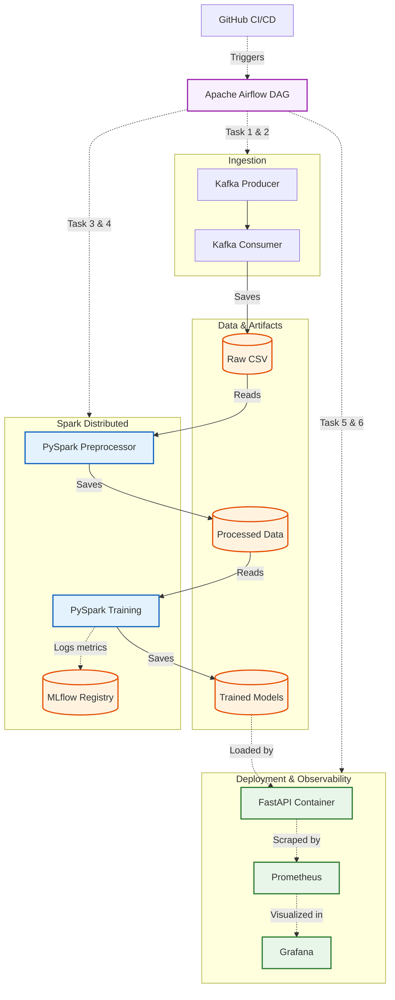

# Team32 Fraud Detection

## Repository URL
https://github.com/SriDA25M530/DA5402W_project_team32_DA25M512_DA25M514_DA25M530

## Team Details
Team number: 32  

DA25M512 – Harish G  
DA25M514 – Jadhav Snehal  
DA25M530 – T Sri Venkatesh  

## Project Overview
We have implemented MLOPS pipeline to solve the business problem of identifying fraudulent credit card transactions
An end-to-end fraud detection pipeline using Apache Kafka for transaction ingestion, Apache Spark for preprocessing and model training, MLflow for experiment tracking, deployment using docker and FastAPI for online predictions, monitoring using Prometheus and Grafana.

We have used the samsai environment(IITM's infrastructure) to build this pipeline. And monitoring is done using locally installed prometheus and grafana.

## Architecture

1. `fraudTrain.csv` is published to Kafka by the producer.
2. The consumer writes Kafka messages to a CSV file in `data/raw`.
3. Spark preprocessing creates time, distance, encoded categorical, and
	 scaled numerical features in `data/processed`.
4. Spark trains Logistic Regression and Gradient-Boosted Tree classifiers and
	 saves them below `data/models/<DAG_ID>`.
5. Docker and FastAPI loads both models and exposes prediction, health, and Prometheus
	 metrics endpoints.
6. Visualisation of metrics using prometheus and grafana

## Architecture diagram

## Set up And Installation Instructions
### Repository Layout

```text
data/raw/                 Source and Kafka-consumed CSV files
data/processed/           Spark output used for training
data/models/              Saved Spark ML models
dags/                     Airflow pipeline definitions
src/data_ingestion/       Kafka producer and consumer
src/features/             Spark feature preprocessing
src/models/               Spark model training
src/serve/api.py          FastAPI application
docker/                   API image and Docker Compose configuration
tests/                    Project tests
```

### Requirements

- Python 3.11 (the API image uses Python 3.11)
- Java 11 for PySpark
- Docker and Docker Compose
- Apache Kafka, Spark, and Airflow for the complete pipeline
- MLflow for training experiment tracking

Install the currently declared Python dependencies with:

```bash
pip install -r requirements.txt
```

The ingestion and training scripts also require the packages they import,
including `pandas`, `kafka-python`, and `mlflow`. Install those separately in
the execution environment if they are not already provided by the Spark or
Airflow image.

### Data and Models

The default project root is:

```text
/storage/uploads/Team32_FraudDetection
```

The API expects this model structure:

```text
data/models/<DAG_ID>/
	logistic_regression/
	gbt_classifier/
```

This checkout contains model artifacts under
`data/models/team32_final_end_to_end_pipeline_V2`. Set `DAG_ID` explicitly when
using those artifacts:

```bash
export BASE_PATH=/storage/uploads/Team32_FraudDetection
export DAG_ID=team32_final_end_to_end_pipeline_V2
```

## Run the API Locally

From the repository root, after setting `BASE_PATH` and `DAG_ID`:

```bash
uvicorn src.serve.api:app --host 0.0.0.0 --port 8009
```

The API loads both Spark models during startup. If either model directory is
missing, startup fails and the service does not become ready.

## API Endpoints

### Health

```bash
curl http://localhost:8009/health
```

### Prediction

The request must contain numeric feature names matching the trained model’s
feature columns. The processed data in this repository uses these 21 features:

```bash
curl -X POST http://localhost:8009/predict \
	-H 'Content-Type: application/json' \
	-d '{
		"features": {
			"trans_hour": 14.0,
			"trans_day_of_week": 3.0,
			"age": 35.0,
			"city_pop": 55000.0,
			"amt_scaled": 2.5,
			"distance_km_scaled": 0.1,
			"gender_M": 1.0,
			"cat_grocery_pos": 0.0,
			"cat_entertainment": 1.0,
			"cat_gas_transport": 0.0,
			"cat_grocery_net": 0.0,
			"cat_shopping_net": 0.0,
			"cat_shopping_pos": 0.0,
			"cat_travel": 0.0,
			"cat_misc_pos": 0.0,
			"cat_health_fitness": 0.0,
			"cat_kids_pets": 0.0,
			"cat_home": 0.0,
			"cat_personal_care": 0.0,
			"cat_food_dining": 0.0,
			"cat_misc_net": 0.0
		}
	}'
```

The response contains a fraud probability and binary prediction from both
`logistic_regression` and `gbt_classifier`.

### Metrics and Documentation

- Prometheus metrics: `http://localhost:8009/metrics`
- OpenAPI UI: `http://localhost:8009/docs`
- Alternative API docs: `http://localhost:8009/redoc`

## Run with Docker

Build and run the API with the model directory mounted through `/storage`:

```bash
docker build -f docker/Dockerfile -t team32-fraud-api .
docker run --rm \
	-p 8009:8000 \
	-v /storage:/storage \
	-e BASE_PATH=/storage/uploads/Team32_FraudDetection \
	-e DAG_ID=team32_final_end_to_end_pipeline_V2 \
	team32-fraud-api
```

The supplied Compose file can be started with:

```bash
docker compose -f docker/docker-compose.yml up --build
```

Its environment currently targets the V1 DAG ID. Change `DAG_ID` in
`docker/docker-compose.yml` to a directory that exists below
`data/models` before starting it.

## Run the Pipeline

The primary Airflow DAG is
`src/data_ingestion/fraud_pipeline_dag.py` (copy or mount it into the Airflow
DAGs directory when configuring Airflow). It orchestrates initialization,
Kafka ingestion, preprocessing, model training, API deployment, and API
testing through Docker and Spark containers.

**From samsai, we can run end to end pipeline using the DAG : "team32_final_end_to_end_pipeline_V2"  
Also, we can make any code / dummy commits to "develop" branch of the given repository to trigger the above pipeline.**
<!-- 
End of file
-->